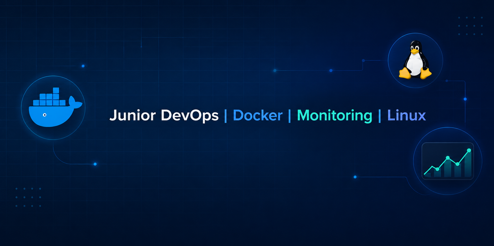

# 👋 Привет, я Иван Кожевников

**Junior DevOps-инженер** с опытом технической поддержки и активными pet-проектами в области контейнеризации, мониторинга и автоматизации.

---

## 🛠 Технологии

| Область | Технологии |
|---------|-------------|
| **Контейнеризация** | Docker, Docker Compose |
| **Мониторинг** | Prometheus, Grafana, cAdvisor, Node Exporter |
| **CI/CD** | GitHub Actions (изучаю, есть рабочий пайплайн) |
| **IaC** | Terraform (базово), Ansible (базово) |
| **ОС** | Linux (Ubuntu/CentOS), Windows Server |
| **Сети** | TCP/IP, DNS, DHCP, VPN |
| **Скрипты** | Bash, Python (начальный) |
| **Облака** | Yandex Cloud (ВМ, сети) |
| **Версионирование** | Git, GitHub |

---

## 📌 Проекты

- **[NWD](https://github.com/uplink0/NWD)** — Мониторинг-стек: Docker Compose + Prometheus + Grafana + cAdvisor. Сбор метрик хоста и контейнеров.
- **[my-first-deploy](https://github.com/uplink0/my-first-deploy)** — Flask-приложение в Docker + CI/CD пайплайн в GitHub Actions.
- *Другие проекты в процессе...*

---

## 📫 Как связаться

- **Email:** ikosay12@gmail.com

---

## 🎯 Цели

Развиваться в DevOps, углублять знания Kubernetes, CI/CD, облачных платформ и инфраструктуры как код. Открыт для стажировок и Junior-позиций.
